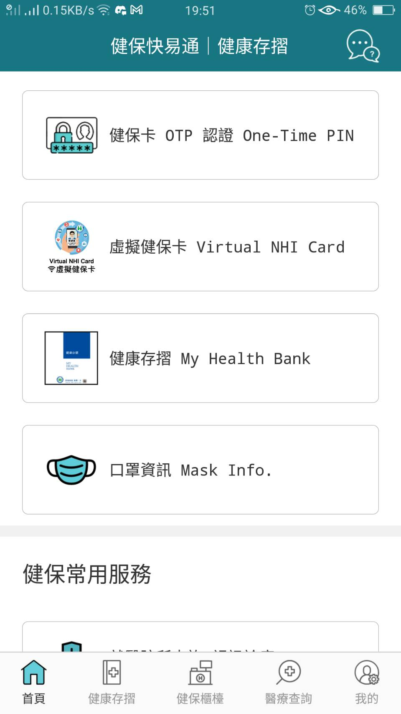
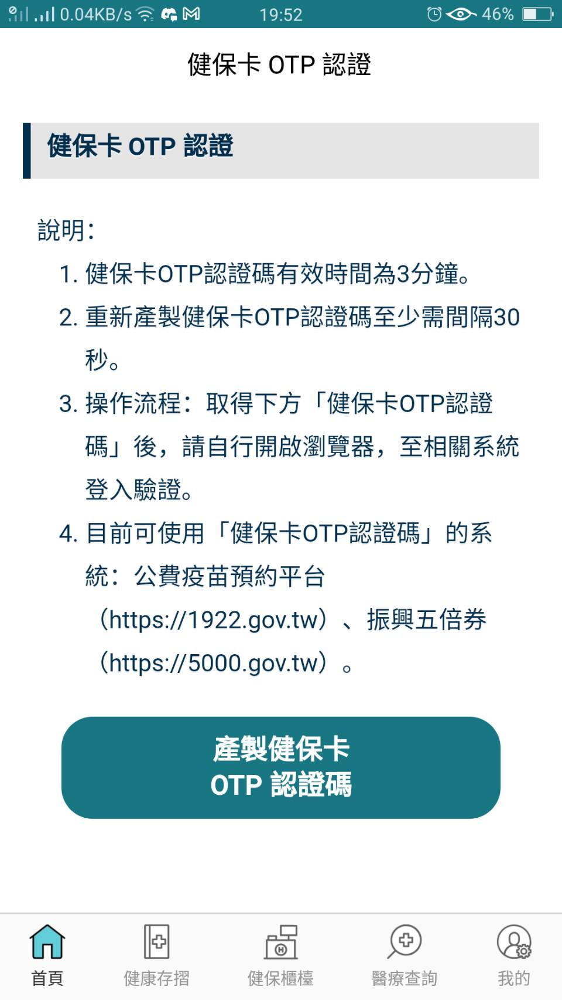
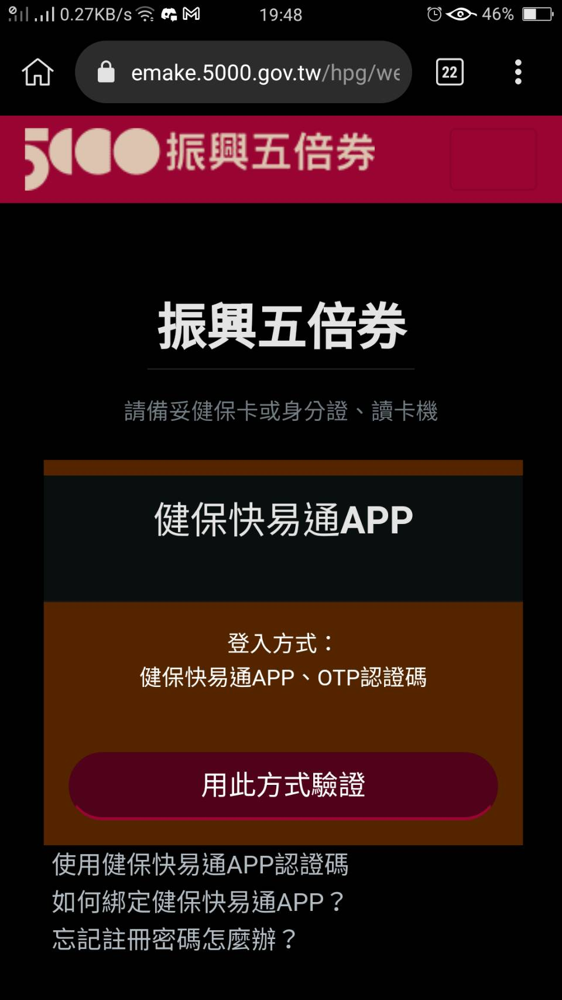
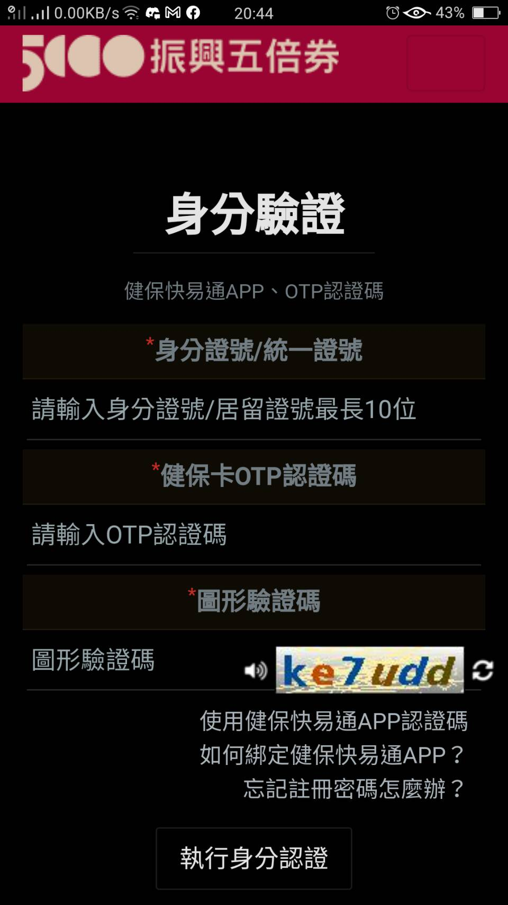

# 如何五倍券共同綁定

這是一篇在家操作的方法，少出門避免感染。

## 預備事項

- 主綁定人必須先綁定好自己的五倍券

由於各家支付介面不同，這邊就不一一說明。沒綁定過的，可先至 [5000.gov.tw](https://5000.gov.tw)，選擇信用卡、電子票證、行動支付，三者其一開始綁定。

如果是紙本，這邊也不說明了，因為沒加碼...

- 準備好五倍券官網的驗證方式(健保 OTP 驗證)

(有 OTP 好處是只需要手機操作，用筆電的也選擇使用讀卡機讀健保卡作為驗證方式，若如此，可略過此項)

主綁定人、被綁定人都要註冊好`健保快易通 APP`。

要是尚未註冊，請先依照[【行動版】全民健保行動快易通APP操作步驟說明](https://www.nhi.gov.tw/Content_List.aspx?n=98F22C99E092DC9A&topn=CA428784F9ED78C9)下載並註冊。

接下來正式共同綁定前，要先知道如何`產生健保 OTP 密碼`

## 如何產生健保 OTP 密碼

- 登入健保快易通
- 到首頁`健保 OTP 認證 One-Time PIN`

{:width="100px"}
<!--  -->

- 點選`產製健保卡 OTP 認證碼`就會產生了

{:width="100px"}
<!--  -->

## 開始綁定

> 有需要 OTP 的，無論是主綁人，或是被綁人，登入該人的`健保快易通`產生即可

- 主綁定人到[五倍券官網 OTP 登入](https://emake.5000.gov.tw/hpg/webLogin?token=bind&language=ch)

{:width="100px"}
<!--  -->
{:width="100px"}
<!--  -->

若是使用筆電，也可選讀卡機登入，這邊就不細說。

- 登入完後，會出現共同綁定的選項，將被綁定人的 OTP 輸入即可，最多五人。

## 常見問題

~~目前未收錄~~
